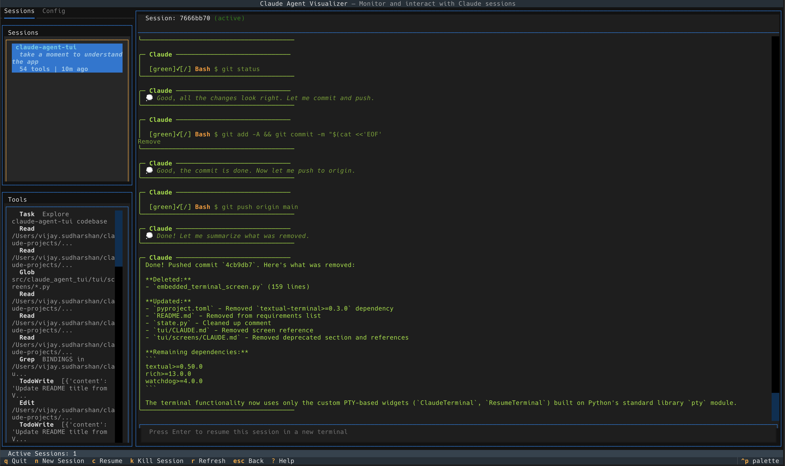
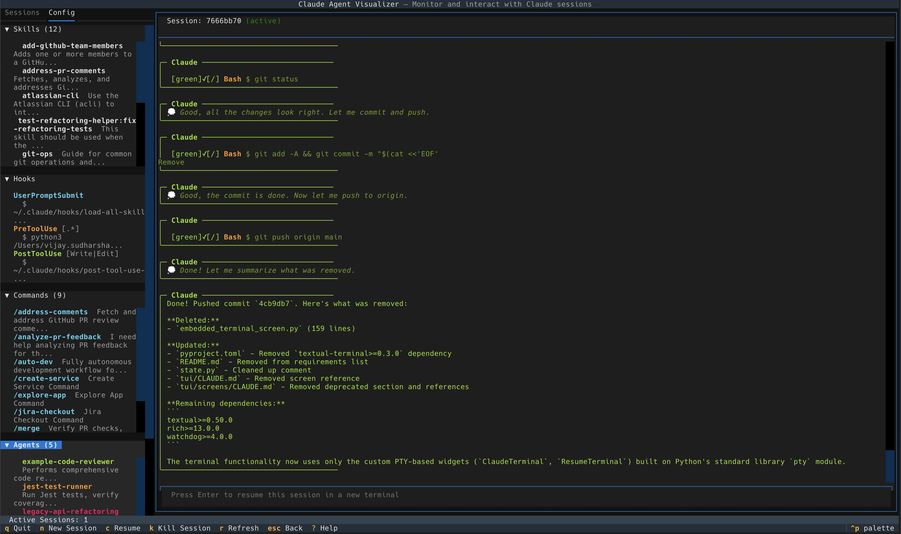

# Claude Agent TUI

A terminal user interface for visualizing and managing Claude Code agent sessions.

## Screenshots

**Sessions Tab** - Browse sessions, inspect tool uses, and view conversation history:



**Config Tab** - View skills, hooks, commands, agents, and MCP servers:



## Features

### Session Management
- **Session Browser**: View all Claude sessions from `~/.claude/projects`
- **Tool Inspector**: See every tool use (Read, Write, Edit, Bash, etc.) with full input/output
- **Active Session Detection**: Highlights sessions with running Claude processes
- **Spawn New Sessions**: Start Claude in embedded terminal or external window
- **Resume Sessions**: Continue existing sessions with `claude --resume`
- **Kill Sessions**: Terminate running Claude processes
- **Live Updates**: Real-time file watching updates sessions as they change

### Configuration Browser
- **Skills**: View custom skills defined in `~/.claude/skills/`
- **Hooks**: Inspect lifecycle hooks from Claude configuration
- **Commands**: Browse slash commands and their definitions
- **Agents**: View agent configurations with their tools and settings
- **MCP Servers**: See configured Model Context Protocol servers

## Installation

```bash
# Install from source
pip install -e .

# Or with development dependencies
pip install -e ".[dev]"
```

## Usage

```bash
# Run with real sessions from ~/.claude/projects
claude-tui

# Run with demo data
claude-tui --demo

# Specify a custom sessions directory
claude-tui -d /path/to/sessions

# Show version
claude-tui --version
```

## Keybindings

| Key | Action |
|-----|--------|
| `n` | New session (spawns new Claude session) |
| `c` | Resume selected session |
| `k` | Kill selected session |
| `r` | Refresh sessions |
| `ESC` | Back navigation (tool → session → base) |
| `q` | Quit |
| `?` | Show help |

## Terminal Controls (Embedded Mode)

When running Claude in an embedded terminal (new or resumed session):

| Key | Action |
|-----|--------|
| `ESC` | Graceful exit (sends `/exit` command to Claude) |
| `Ctrl+C` | Send interrupt to Claude (press twice within 2s to force kill) |
| `Ctrl+Q` | Immediate force quit (SIGTERM) |

## Requirements

### Runtime Dependencies
- **Python 3.10+**
- **Textual >= 0.50.0** - Terminal UI framework
- **Rich >= 13.0.0** - Text formatting and syntax highlighting
- **watchdog >= 4.0.0** - File system monitoring for live session updates

### System Dependencies
- **claude** CLI must be installed and available in PATH
- macOS/Linux (process management uses `ps`, `lsof`, `pgrep`)

## Project Structure

```
src/claude_agent_tui/
├── __init__.py          # Package init with version
├── __main__.py          # CLI entry point
├── cli.py               # CLI wrapper
├── state.py             # Central state management
├── process.py           # Process detection and management
├── demo.py              # Demo data generation
├── discovery/           # Session and config discovery
│   ├── parser.py        # JSONL session parsing
│   ├── watcher.py       # File system watching
│   └── config_parser.py # Config file parsing
├── spawner/             # Session spawning
│   └── terminal.py      # Terminal integration
├── store/               # Data models
│   ├── models.py        # Session, ToolUse models
│   └── config_models.py # Skill, Hook, Agent models
└── tui/                 # Terminal UI
    ├── app.py           # Main Textual application
    ├── screens/         # Full-screen views
    └── widgets/         # UI components
```

See `CLAUDE.md` files in each directory for detailed documentation.

## Development

```bash
# Install dev dependencies
pip install -e ".[dev]"

# Run linting
ruff check src/

# Run type checking
mypy src/

# Run tests
pytest
```

## License

MIT License - see [LICENSE](LICENSE) for details.
